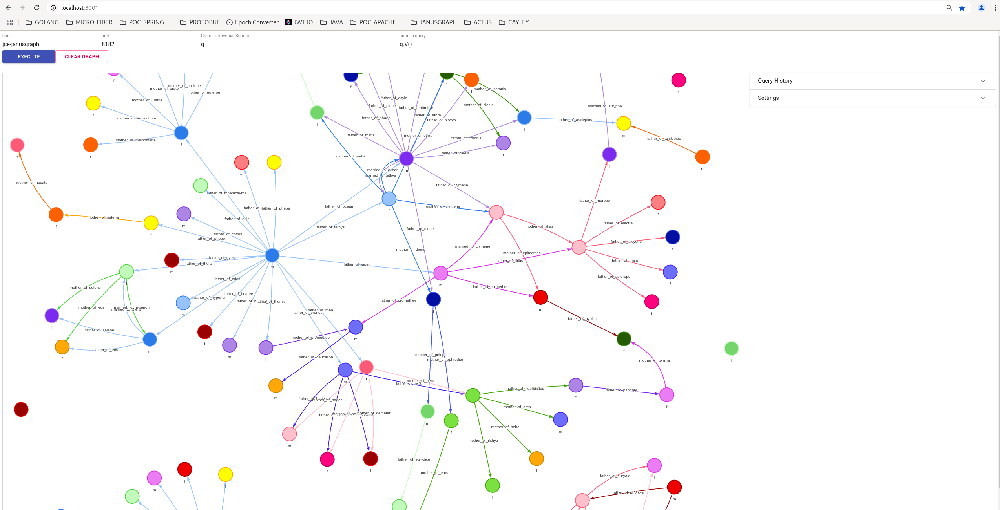
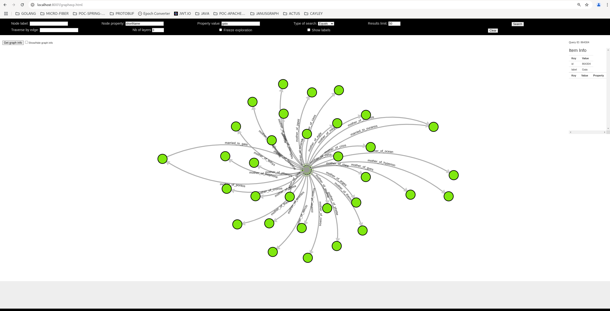

# JanusGraph

```bash
docker-compose -f janus-graph.yml up -d
```

Credits: https://github.com/deviantony/docker-elk

Containers


| Service               | Version | Port | Description      |
|-----------------------|---------|------|------------------|
| janusgraph            | -       | 8182 | JanusGraph       |
| cassandra             | 4.0.17  | 9042 | Cassandra        |
| elasticsearch         | 8.17.2  | 9200 | Elasticsearch    |
| janusgraph-visualizer | -       | 3001 | Graph visualizer |
| graphexp              | -       | 8001 | Graph visualizer |

                               

**Connecting to Janus Graph**

* First enter janus graph container

```bash
docker exec -it jce-janusgraph bash
```

* Then launch gremlin

```bash
bin/gremlin.sh
```

* Then connect to JanuGraph backend (cassandra)

```bash
graph = JanusGraphFactory.open('cql:cassandra')
g = graph.traversal()
g.V().count()
```

* Once done, launch spring-boot PocGraph application

* Create schema, vertices and edges either using "VERTEX-SCHEMA" in "Bruno" collection or use curl

curl - X POST http://localhost:8080/api/v1/schema

** Gremlin

Deleting all vertices
```
g.V().drop()
```

** Visualizers:

JanusGraph visualizer:  http://localhost:3001/



GraphExp: http://localhost:8001/graphexp.html



Connection: 
* Server Address: 192.168.1.x
* Server Port: 8182
* Protocol: websocket
* Gremlin version: 3.4